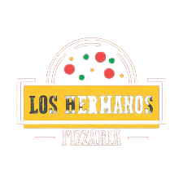

  

   

<a href="https://loshermanos-dashboard-client.vercel.app/">Clique para visitar o projeto</a>

    

 

  &nbsp;&nbsp;
  &nbsp;&nbsp;
  &nbsp;&nbsp;
  

 

  <a href="#-tecnologias">Tecnologias</a>&nbsp;&nbsp;&nbsp;|&nbsp;&nbsp;&nbsp;
  <a href="#-projeto">Projeto</a>&nbsp;&nbsp;&nbsp;|&nbsp;&nbsp;&nbsp;
  <a href="#-layout">Layout</a>&nbsp;&nbsp;&nbsp;|&nbsp;&nbsp;&nbsp;
  <a href="#-licença">Licença</a>&nbsp;&nbsp;&nbsp;&nbsp;&nbsp;&nbsp;

## 🚀 Tecnologias

Este projeto foi desenvolvido com as seguintes tecnologias:

-   <a href="https://nodejs.org/en/">NextJS</a>
-   <a href="https://styled-components.com/">Styled-components</a>
-   <a href="https://react-query-v2.tanstack.com/">React Query</a>
-   <a href="https://react-hook-form.com/">React Hook Form</a>
-   <a href="https://apexcharts.com/">ApexCharts</a>
-   <a href="https://www.typescriptlang.org/">Typescript</a>

## 💻 Projeto

Los Hermanos dashboard é um projeto de dashboard para gerenciamento da pizzaria Los Hermanos, a aplicação tem como objetivo controlar as vendas do estabelecimento e gerar gráficos de desempenho para que os proprietários possam analisar seu negócio e identificar pontos com capacidade de melhora.
O sistema atualmente conta com as seguintes funcionalidades:

-   Cadastro de conta
-   Cadastro de múltiplos usuários para mesma conta
-   Autenticação de usuário
-   Gerenciamento de produtos (Criação, Edição, Atualização e Deleção)
-   Gerenciamento de clientes (Criação, Edição, Atualização e Deleção)
-   Gerenciamento de vendas (Criação, Edição, Atualização e Deleção)
-   Levantamento de total diário arrecadado
-   Levantamento de total arrecadado no mês
-   Levantamento de total de pedidos no mês
-   Balanço mensal, com criação de histórico anual
-   Rankeamento de produtos mais vendidos

## 🔖 Layout

Você pode visualizar o layout do projeto através [desse link](https://www.figma.com/file/5CcnUXRrXdKpUQezUykQ9a/Dashboard-Pizzaria?node-id=704%3A2). É necessário ter conta no [Figma](https://figma.com) para acessá-lo.

## :memo: Licença

Este projeto está sob a licença do MIT. Veja o [LICENSE](https://github.com/hitaloalvess/loshermanos-dashboard-client/blob/main/LICENSE) para maiores informações.

---

Made with ♥ by Hitalo 🚀
